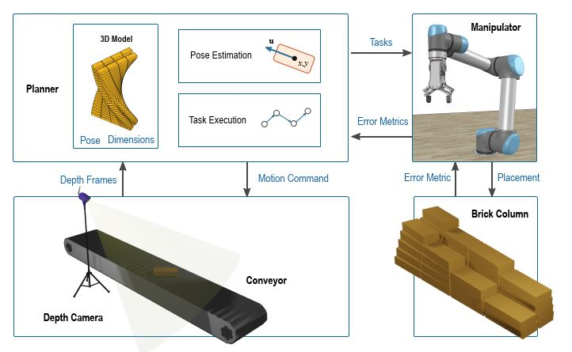
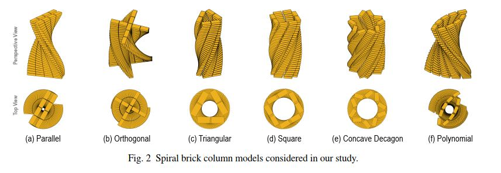
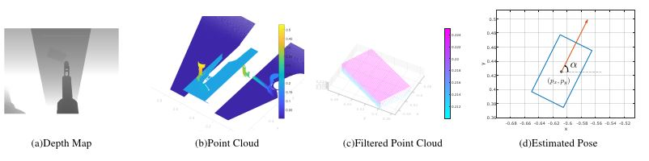
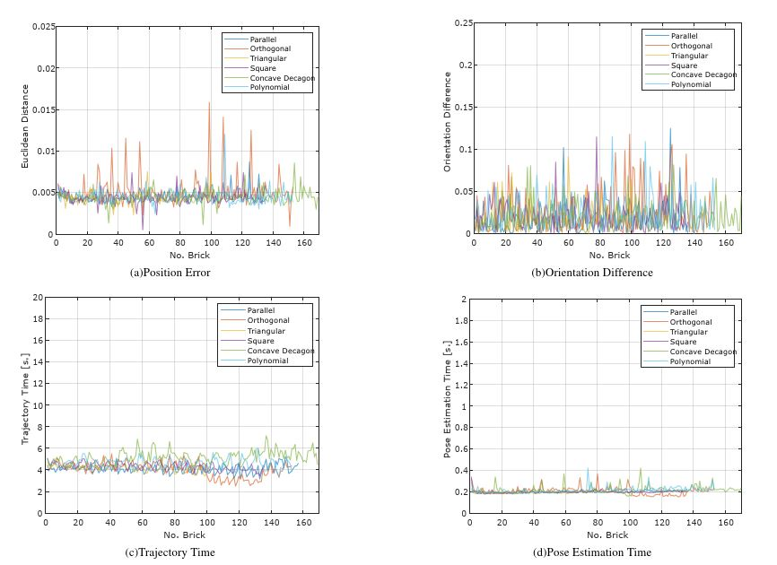
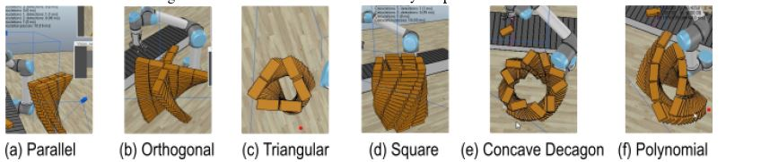

# Towards Spiral Brick Column Building Robots
This repository presents the research and development of a novel approach for automating the construction of spiral brick columns using robotic systems. Our work introduces a task-level strategy aimed at enhancing the efficiency and effectiveness of assembling spiral brick columns through robotic manipulation.

## Introduction
This paper explores the automation in construction,  emphasizing the novel task-level planning for the assembly of spiral brick columns. The motivation behind this research lies in the growing need for automation in the construction industry. Spiral brick columns, known for their aesthetic and structural qualities, present unique challenges for automation. Our study addresses these challenges by proposing a comprehensive framework that leverages robotic manipulation for assembly. We demonstrate a methodological approach that significantly improves construction precision and speed. Utilizing extensive computational simulations and generalized models, we demonstrate the feasibility, effectiveness, and efficiency of our proposed approach, highlighting the potential for using robots in the automated construction of spiral brick columns.

  <em>Figure 1:  Basic idea of the general framework in our approach. The manipulator is attached to a gripper and is tasked with assembling a user-defined spiral brick column using incoming bricks from a belt conveyor.</em>
<!-- 

 -->

## Proposed Approach

We detail a comprehensive framework involving building modeler, pose estimator, and task executioner components. This approach enables effective and efficient assembly of user-defined spiral brick columns using a manipulator and incoming bricks from a belt conveyor. The proposed a multi-faceted approach involving:

* Spiral Brick Models: Designing computational models for various spiral configurations.

  <em>Figure 2: Spiral brick column models considered in our study. </em>
<!-- 

 -->

* Pose Estimation: Developing algorithms for accurate brick positioning.

  <em>Figure 3:  Example of the filtered point cloud of brick and its estimated pose. </em>
<!-- 

 -->

* Task Execution Framework: Implementing a sequence of robotic actions for efficient brick placement.

## Computational Experiments & Results
Our simulations conducted in Matlab and CoppeliaSim environments validate the effectiveness of our approach. Performance metrics include position and orientation errors, pose estimation times, and trajectory times for assembling spiral brick columns.

  <em>Figure 4:  Performance metrics in the assembly of spiral brick columns. </em>
<!-- 

 -->

  <em>Figure 5:  Examples of the performance while assembling spiral brick columns. </em>
<!-- 

 -->
## Conclusion
The findings confirm the viability of robotic automation in enhancing the construction process of spiral brick columns, promising significant advancements in construction automation.

